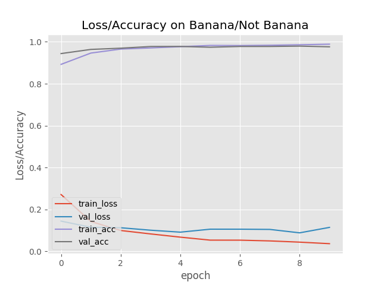

# Banana Recognizer 🍌

**Convolutional Neural Network:** `BananaNetwork/banana_net_17_12_18.h5`

> `BananaNetwork/banana_net.h5 is currently overfitted`

* Also looking at other alternatives for design of network

Layers: `2DConv > MaxPool > Flatten > Relu > Sigmoid`

##### File structure

TBA

#### Datasets

* Fruit365
* Synset - ImageNet
* Google Images

#### Performance

